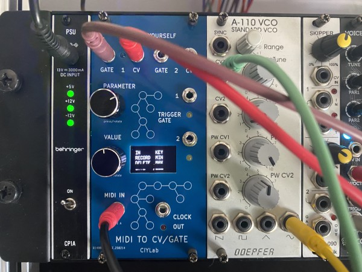

## À quoi ça sert ?

À générer des CV/Gate dans un rack à partir d'un clavier MIDI.

## Exemple de configuration 

Dans un rack on peut simultanément enregistrer :
- un kick
- un snare
- une ligne de basse
- une mélodie

